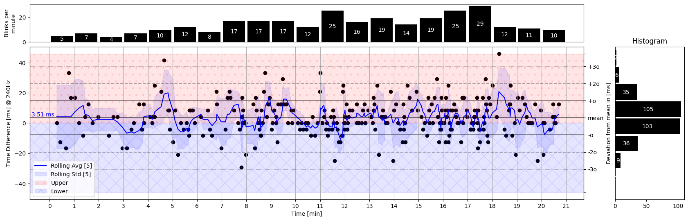
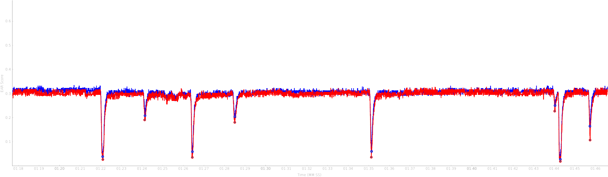

# Summary

Analyzing facial features and expressions is a challenging task in computer vision.
The human face is a complex object with a high degree of shape, texture, and appearance variability.
Medical areas deviating from typical facial structures, e.g., due to paralysis, are of interest and require a precise analysis.
The delicate movement of the eye blink is a yet-to-be-fully understood process and requires high temporal resolution for detailed analysis.
However, many modern computer vision approaches require programming skills to be used and need to be more easily integrated into the workflow of medical experts.
`JeFaPaTo` - the Jena Facial Palsy Toolbox - aims to overcome this gap by leveraging modern computer vision algorithms and providing a user-friendly interface for non-programmers.

The state of the eye closure is of high interest to medical experts, e.g., in the context of facial palsy or Parkinson's disease.
Due to facial nerve damage, the eye-closing process might be impaired and could lead to many undesirable side effects.
Hence, more than a simple distinction between open and closed eyes is required for a detailed analysis.
Factors such as duration, synchronicity, velocity, complete closure, the time between blinks, and frequency over time are highly relevant.
Such detailed analysis could help medical experts better understand the blinking process, its deviations, and possible treatments for better eye care.

# Statement of need

To analyze the blinking behavior in detail, medical experts often use high-speed cameras to record the blinking process.
Therefore, experiments record videos with 240 FPS or higher, which results in large amounts of data and requires optimized algorithms for consumer hardware.
`JeFaPaTo` is a Python-based [@python] program to support medical and psychological experts in analyzing blinking and facial features for high temporal resolution video data.
The tool splits into two main parts: An extendable programming interface and a graphical user interface (GUI) entirely written in Python.
The programming interface reduces the overhead of dealing with high temporal resolution video data, automatically extracts selected facial features, and provides a set of analysis functions specialized for blinking analysis.
The GUI provides non-programmers an intuitive way to use the analysis functions, visualize the results, and export the data for further analysis.
`JeFaPaTo` is designed to be extendable by additional analysis functions and facial features and is under joint development by computer vision and medical experts to ensure high usability and relevance for the target group.

`JeFaPoTo` leverages the `mediapipe` library [@lugaresiMediaPipeFrameworkBuilding2019;@kartynnikRealtimeFacialSurface2019a] to extract facial landmarks and blend shape features from video data at 60 FPS (on modern hardware).
With the landmarks, we compute the `EAR` (Eye-Aspect-Ratio) [@soukupovaRealTimeEyeBlink2016] for both eyes over the videos.
Additionally, `JeFaPaTo` detects blinks, matches left and right eye, and computes a summary, shown in \autoref{fig:summary}, for the provided video and exports the data in various formats for further independent analysis.
We leverage `PyQt6` [@pyqt6;@qt6] and `pyqtgraph` [@pyqtgraph] to provide a GUI on any platform for easy usage.

To support and simplify the usage of `JeFaPaTo`, we provide a standalone executable for Windows, Linux, and MacOS.
`JeFaPaTo` is currently used in three medical studies to analyze the blinking process of healthy probands and patients with facial palsy and Parkinson's disease.

# Functionality and Usage

`JeFaPaTo` was developed to support medical experts in extracting, analyzing, and studying the blinking behavior.
Hence, the correct localization of facial landmarks is of high importance and the first step in the analysis process of each frame.
Once a user provides a video in the GUI, the tool performs an automatic face detection, and the user can adapt the bounding box if necessary.
Due to the usage of `mediapipe` [@lugaresiMediaPipeFrameworkBuilding2019;@kartynnikRealtimeFacialSurface2019a], the tool can extract 468 facial landmarks and an additional 52 blend shape features.
To describe the state of the eye, we use the Eye-Aspect-Ratio (EAR) [@soukupovaRealTimeEyeBlink2016], a standard measure for blinking behavior computed based on the 2D coordinates of the landmarks.
This measure describes the ratio between the vertical and horizontal distance between the landmarks, resulting in a detailed behavior approximation of the upper and lower eyelids.
Please note that all connotations for the left and right eye are based on the person's perspective in the video.

We denote this measure as `EAR-2D-6`, and the six facial landmarks are selected for both eyes, as shown in \autoref{fig:ear}, and are computed for each frame.
As `mediapipe` [@lugaresiMediaPipeFrameworkBuilding2019;@kartynnikRealtimeFacialSurface2019a] belongs to the monocular approaches for facial reconstruction, each landmark contains an estimated depth value.
We offer the `EAR-3D-6` feature as an alternative, computed based on the 3D coordinates of the landmarks, to leverage this information to minimize the influence of head rotation.
However, the first experiments indicated that the 2D approach is sufficient to analyze blinking behavior.

`JeFaPaTo` optimizes the loading of the video by utilizing several queues for loading and processing, assuring adequate RAM usage.
The processing pipeline extracts the landmarks and facial features, such as the `EAR` score for each frame, and includes a validity check.
On completion, all values are stored in a CSV file for either external tools or inside `JeFaPaTo` to obtain insights into the blinking behavior of a person, shown in \autoref{fig:summary}.
The blinking detection and extraction employ the `scipy.signal.find_peaks` algorithm [@virtanenSciPyFundamentalAlgorithms2020], and the time series can be smoothed if necessary.
In \autoref{fig:timeseries}, we show the time series of the `EAR` score for the left and right eye during a video with 240 FPS.
The dots indicate the detection of a blink, and are the basis for the blinking extraction and matching.
`JeFaPaTo` will automatically match the left and right eye blinks and provide the statistics for both eyes based on the moment of high closure.

After the extraction, the user can manually correct the blinking behavior in a table, e.g., labeling the blinking state as `none,` `partial,` or `full` closure.
To simplify this process, the user can drag and drop the according video into the GUI, and `JeFaPaTo` will jump to the according frame.
The summary statistics are computed once the blinking behavior is corrected, and the data can be exported for further analysis.
The data can be exported as CSV files or as a single Excel file containing the time series of the `EAR` score, the blinking behavior, and the summary statistics.
We provide a sample file for the score in the repository's `examples/` directory.

# Platform Support

As `JeFaPaTo` is written in Python, it can be used on any platform that supports Python and the underlying libraries.
We recommend the usage of `anaconda` [@anaconda] for creating encapsulated Python environments to reduce the interference of already installed libraries and version mismatches.
The script `dev_init.sh` automatically creates the custom environment with all dependencies with the `main.py` as the entry point for running the `JeFaPaTo`.
The user can also use the `requirements.txt` file to install the dependencies manually, even though we recommend alteast the usage of virtual environments.
As `JeFaPaTo` is intended to be used by non-programmers, we support the most common platforms.
We provide each release a standalone executable for Windows 10, Linux (Ubuntu 22.04), and MacOS (version 13+ for Apple Silicon and Intel).
We offer a separate branch for MacOS version pre 13 (Intel), which does not contain blend shape extraction, to support older hardware.
The authors and medical partners conduct all user interface and experience tests on `Windows 10` and `MacOS 13+ (Apple Silicon)`.

# Ongoing Development

`JeFaPaTo` finished the first stable release and will continue to be developed to support the analysis of facial features and expressions.
As high temporal resolution video data might open new insights into facial movements, we plan to implement standard 2D measurement-based features.
A common side effect of facial palsy is synkinesis, which is the involuntary movement of facial muscles during intended movement of other facial muscles.
It is often observed that the eye closes when the patient smiles or, vice versa.
Hence, a joint analysis of the blinking pattern and mouth movement could help better understand the underlying processes.
The EAR is sensitive to head rotation but can be avoided mainly due to the experimental setup.
To support the analysis of facial palsy patients, we plan to implement a 3D head pose estimation to correct the future EAR score for head rotation.
We plan to automatically label the blinking state in a future version to simplify the analyzing process further.

# Acknowledgements

Supported by Deutsche Forschungsgemeinschaft (DFG - German Research Foundation) project 427899908 BRIDGING THE GAP: MIMICS AND MUSCLES (DE 735/15-1 and GU 463/12-1).
We acknowledge the helpful feedback for the user-interface development and quality-of-life requests from Lukas Schuhmann, Elisa Furche, Elisabeth Hentschel, and Yuxuan Xie.

# References