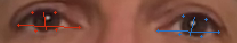
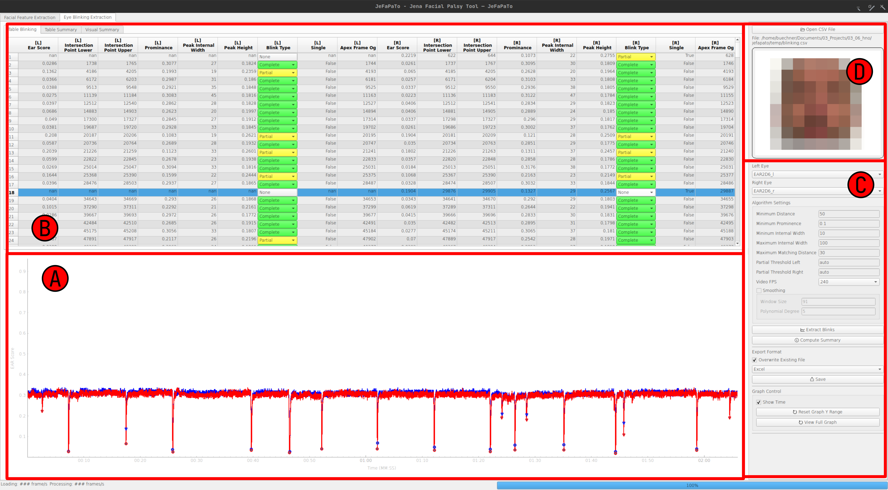

# Summary

Analyzing facial features and expressions is a complex task in computer vision.
The human face is intricate, with significant shape, texture, and appearance variations.
In medical contexts, facial structures that differ from the norm, such as those affected by paralysis, are particularly important to study and require precise analysis.
One area of interest is the subtle movements involved in blinking, a process that is not yet fully understood and needs high-resolution, time-specific analysis for detailed understanding.
However, a significant challenge is that many advanced computer vision techniques demand programming skills, making them less accessible to medical professionals who may not have these skills.
The Jena Facial Palsy Toolbox (JeFaPaTo) has been developed to bridge this gap.
It utilizes cutting-edge computer vision algorithms and offers a user-friendly interface for those without programming expertise.
This toolbox is designed to make advanced facial analysis more accessible to medical experts, simplifying integration into their workflow.

The state of the eye closure is of high interest to medical experts, e.g., in the context of facial palsy or Parkinson's disease.
Due to facial nerve damage, the eye-closing process might be impaired and could lead to many undesirable side effects.
Hence, more than a simple distinction between open and closed eyes is required for a detailed analysis.
Factors such as duration, synchronicity, velocity, complete closure, the time between blinks, and frequency over time are highly relevant.
Such detailed analysis could help medical experts better understand the blinking process, its deviations, and possible treatments for better eye care.

# Statement of need

To analyze the blinking behavior in detail, medical experts often use high-speed cameras to record the blinking process.
Therefore, experiments record videos with 240 FPS or higher, which results in large amounts of data and requires optimized algorithms for consumer hardware.
`JeFaPaTo` is a Python-based [@python] program to support medical and psychological experts in analyzing blinking and facial features for high temporal resolution video data.
The tool splits into two main parts: An extendable programming interface and a graphical user interface (GUI) entirely written in Python.
The programming interface enables efficient processing of temporal resolution video data, automatically extracts selected facial features, and provides a set of analysis functions specialized for blinking analysis.
The GUI offers non-programmers an intuitive way to use the analysis functions, visualize the results, and export the data for further analysis.
`JeFaPaTo` is designed to be extendable by additional analysis functions and facial features and is under joint development by computer vision and medical experts to ensure high usability and relevance for the target group.

`JeFaPaTo` leverages the `mediapipe` library [@lugaresiMediaPipeFrameworkBuilding2019;@kartynnikRealtimeFacialSurface2019a] to extract facial landmarks and blend shape features from video data at 60 FPS (on modern hardware).
With the landmarks, we compute the `EAR` (Eye-Aspect-Ratio) [@soukupovaRealTimeEyeBlink2016] for both eyes over the videos.
Additionally, `JeFaPaTo` detects blinks, matches left and right eye, and computes medically relevant statistics, a visual summary for the provided video, shown in \autoref{fig:summary}, and exports the data in various formats for further independent analysis.
The visual summary lets medical experts quickly get an overview of the blinking behavior.
As shown in \autoref{fig:summary}, the blinks per minute are shown as a histogram over time in the upper axis, and the delay between blinks is shown in the right axis.
The main plot comprises the scatter plot of the `EAR` score for the left and right eye, and the dots indicate the detected blinks, with the rolling mean and standard deviation shown as a line plot.
This summary creates a compact overview by summarizing the blinking behavior throughout the video, enabling a quick individualized analysis for each video.

We leverage `PyQt6` [@pyqt6;@qt6] and `pyqtgraph` [@pyqtgraph] to provide a GUI on any platform for easy usage.
To support and simplify the usage of `JeFaPaTo`, we provide a standalone executable for Windows, Linux, and MacOS.
`JeFaPaTo` is currently used in three medical studies to analyze the blinking process of healthy probands and patients with facial palsy and Parkinson's disease.

# Functionality and Usage

`JeFaPaTo` was developed to support medical experts in extracting, analyzing, and studying blinking behavior.
Hence, the correct localization of facial landmarks is of high importance and the first step in the analysis process of each frame.
Once a user provides a video in the GUI, the tool performs an automatic face detection, and the user can adapt the bounding box if necessary.
Due to the usage of `mediapipe` [@lugaresiMediaPipeFrameworkBuilding2019;@kartynnikRealtimeFacialSurface2019a], the tool can extract 468 facial landmarks and 52 blend shape features.
To describe the state of the eye, we use the Eye-Aspect-Ratio (EAR) [@soukupovaRealTimeEyeBlink2016], a standard measure for blinking behavior computed based on the 2D coordinates of the landmarks.
The ratio ranges between 0 and 1, where 0 indicates a fully closed eye and higher values indicate an open eye, while we observed that most people have an EAR score between 0.2 and 0.4.
This measure describes the ratio between the vertical and horizontal distance between the landmarks, resulting in a detailed motion approximation of the upper and lower eyelids.
Please note that all connotations for the left and right eye are based on the subject's viewing perspective.

We denote this measure as `EAR-2D-6`, and the six facial landmarks are selected for both eyes, as shown in \autoref{fig:ear}. They are computed for each frame without any temporal smoothing.
As `mediapipe` [@lugaresiMediaPipeFrameworkBuilding2019;@kartynnikRealtimeFacialSurface2019a] belongs to the monocular depth reconstruction approaches for faces, each landmark contains an estimated depth value.
We offer the `EAR-3D-6` feature as an alternative, computed from 3D coordinates of the landmarks, to leverage this information to minimize the influence of head rotation.
However, the first experiments indicated that the 2D approach is sufficient to analyze blinking behavior.

`JeFaPaTo` optimizes io-read by utilizing several queues for loading and processing the video, assuring adequate RAM usage.
The processing pipeline extracts the landmarks and facial features, such as the `EAR` score for each frame, and includes a validity check ensuring that the eyes have been visible.
On completion, all values are stored in a CSV file for either external tools or for further processing by `JeFaPaTo` to obtain insights into the blinking behavior of a person, shown in \autoref{fig:summary}.
The blinking detection and extraction employ the `scipy.signal.find_peaks` algorithm [@virtanenSciPyFundamentalAlgorithms2020], and the time series can be smoothed if necessary.
We automatically match the left and right eye blinks based on the time of apex closure.
Additionally, we use the prominence of the blink to distinguish between `complete` and `partial` blinks based on a user-provided threshold (for each eye) or an automatic threshold computed using Otsu's method [@otsu].
The automatic threshold detection uses all extracted blinks for each eye individually.
Considering the personalized nature of blinking behavior, a graphical user interface (GUI) is provided, enabling experts to adjust the estimated blinking state as needed manually.
Additional functions are included in calculating blinking statistics: the blink rate (blinks per minute), the mean and standard deviation of the Eye Aspect Ratio (EAR) score, the inter-blink delay, and the blink amplitude.
A graphical user interface (GUI) for the `JeFaPaTo` codebase is provided, as depicted in \autoref{fig:ui}, to facilitate usage by individuals with limited programming expertise and to streamline data processing.

In \autoref{fig:ui}, we show the blinking analysis graphical user interface composed of four main areas.
We give a short overview of the functionality of each area to provide a better understanding of the tool's capabilities.
The A-Area is the visualization of the selected EAR time series for the left (drawn as a blue line) and right eye (drawn as a red line) over time.
Additionally, after successful blinking detection and extraction, the detected `complete` blinks (pupil not visible) are shown as dots, and `partial` blinks (pupil visible) as triangles.
If the user selects a blink in the table in the B-Area, the graph automatically highlights and zooms into the corresponding area to allow a detailed analysis.

The B-Area contains the main table for the blinking extraction results, and the user can select the a blink to visualize the corresponding time range in the EAR plot.
The table contains the main properties of the blink: the EAR score at the blink apex, the prominence of the blink, the internal width in frames, the blink height, and the automatically detected blinking state (`none`, `partial`, `complete`).
If the user provides the original video, the user can drag and drop the video into the GUI into the D-Area, and the video will jump to the corresponding frame to manually correct the blinking state.
The content of the table is used to compute the blinking statistics and the visual summary.
These statistics are also shown in the B-Area at different tabs, and the user can export the data as a CSV or Excel file for further analysis.

The C-Area is the control area, where the user can load the extracted EAR scores from a file and select the corresponding columns for the left and right eye (an automatic pre-selection is done).
The user can choose the parameters for the blinking extraction, such as the minimum prominence, distance between blinks, and the minimum blink width.
Additionally, users can define the decision threshold for estimating 'partial' blinks should the 'auto' mode prove inadequate.
Upon data extraction, corrections to the blinking state can be made directly within the table, following which the computation of blinking statistics and the generation of the visual summary can be initiated.

The D-Area displays the current video frame, given that the user supplies the original video.
While this feature is optional, it helps manually correct the blinking state when required.

## Extracted Medical Relevant Statistics

We provided a set of relevant statistics for medical analysis of blinking behavior, which are valuable to healthcare experts.
The `JeFaPaTo` software is being developed in partnership with medical professionals to guarantee the included statistics are relevant.
Future updates may incorporate new statistics based on expert medical feedback.
A sample score file is available in the `examples/` directory within the repository, enabling users to evaluate the functionality of `JeFaPaTo` without recording a video.

| Statistic                     | Description                                                          | Unit/Range |
|------|-------|---:|
| EAR_Before_Blink_left_avg     | The average left eye EAR score three seconds before the first blink             | $[0,1]$ |
| EAR_Before_Blink_right_avg    | The average right eye EAR score three seconds before the first blink            | $[0,1]$ |
| EAR_left_min                  | The minimum left eye EAR score of the time series                               | $[0,1]$ |
| EAR_right_min                 | The minimum right eye EAR score of the time series                              | $[0,1]$ |
| EAR_left_max                  | The maximum left eye EAR score of the time series                               | $[0,1]$ |
| EAR_right_max                 | The maximum right eye EAR score of the time series                              | $[0,1]$ |
| Partial_Blink_threshold_left  | The threshold to distinguish `partial` or `complete` state                      | $[0,1]$ |
| Partial_Blink_threshold_right | The threshold to distinguish `partial` or `complete` state                      | $[0,1]$ |
| Prominence_min                | The minimum prominence value of all blinks (left and right eye )                | $[0,1]$ |
| Prominence_max                | The maximum prominence value of all blinks (left and right eye )                | $[0,1]$ |
| Prominence_avg                | The average prominence value of all blinks (left and right eye )                | $[0,1]$ |
| Width_min                     | The minimum width value of all blinks (left and right eye )                     | $[0,1]$ |
| Width_max                     | The maximum width value of all blinks (left and right eye )                     | $[0,1]$ |
| Width_avg                     | The average width value of all blinks (left and right eye )                     | $[0,1]$ |
| Height_min                    | The minimum height value of all blinks (left and right eye)                     | $[0,1]$ |
| Height_max                    | The maximum height value of all blinks (left and right eye)                     | $[0,1]$ |
| Height_avg                    | The average height value of all blinks (left and right eye)                     | $[0,1]$ |
| Partial_Blink_Total_left      | The amount of `partial` blinks for the left eye                                 | $\mathbb{N}$   |
| Partial_Blink_Total_right     | The amount of `partial` blinks for the right eye                                | $\mathbb{N}$   |
| Partial_Frequency_left_bpm    | The frequency per minute of `partial` left blinks through out the video         | $1/\text{min}$ |
| Partial_Frequency_right_bpm   | The frequency per minute of `partial` right blinks through out the video        | $1/\text{min}$ |
| Blink_Length_left_ms_avg      | The mean value of the blink length of the left eye                              | Time in $ms$ |
| Blink_Length_left_ms_std      | The standard deviation value of the  blink length of the left eye               | Time in $ms$ |
| Blink_Length_right_ms_avg     | The mean value of the blink length of the right eye                             | Time in $ms$ |
| Blink_Length_right_ms_std     | The standard deviation value of the  blink length of right left eye             | Time in $ms$ |
| Partial_Blinks_min[NN]_left   | The amount of `partial` blinks in the left eye during minute $NN$ of the video  | $\mathbb{N}$|
| Partial_Blinks_min[NN]_right  | The amount of `partial` blinks in the right eye during minute $NN$ of the video | $\mathbb{N}$|
| Complete_Blink_Total_left     | The amount of `complete` blinks in the left eye during minute $NN$ of the video | $\mathbb{N}$|
| Complete_Blink_Total_right    | The amount of `complete` blinks in the right eye during minute $NN$ of the video| $\mathbb{N}$|
| Complete_Frequency_left_bpm   | The frequency per minute of `complete` left blinks through out the video        | $1/\text{min}$ |
| Complete_Frequency_right_bpm  | The frequency per minute of `complete` right blinks through out the video       | $1/\text{min}$ |
| Complete_Blinks_min[NN]_left  | The amount of `complete` blinks in the left eye during minute $NN$ of the video | $\mathbb{N}$|
| Complete_Blinks_min[NN]_left  | The amount of `complete` blinks in the right eye during minute $NN$ of the video| $\mathbb{N}$|

# Platform Support

As `JeFaPaTo` is written in Python, it can be used on any platform that supports Python and the underlying libraries.
We recommend the usage of `anaconda` [@anaconda] to create encapsulated Python environments to reduce the interference of already installed libraries and possible version mismatches.
The script `dev_init.sh` automatically creates the custom environment with all dependencies with the `main.py` as the entry point for running the `JeFaPaTo`.
The user can also use the `requirements.txt` file to install the dependencies manually, even though we recommend creating a virtual environment at the very least.
As `JeFaPaTo` is designed to be used by medical experts, we provide a graphical user interface (GUI) to simplify usage during clinical studies and routine analysis.
We give each release a standalone executable for Windows 11, Linux (Ubuntu 22.04), and MacOS (version 13+ for Apple Silicon and Intel).
We offer a separate branch for MacOS version pre-13 (Intel), which does not contain blend shape extraction, to support older hardware.
The authors and medical partners conduct all user interface and experience tests on `Windows 11` and `MacOS 13+ (Apple Silicon)`.

## Libraries

We list the main libraries used in `JeFaPaTo` and their version used for the development.

| Library | Version | Category | Usage |
|---|---|---|------|
| `numpy`                  | `>=1.19`    | Processing    | Image matrices and time series |
| `opencv-python-headless` | `>=4.5`     | Processing    | Image processing |
| `protobuf`               | `>=3.11,<4` | Processing    | Loading of precomputed models |
| `psutil`                 | `~=5.8`     | Processing    | Computation of RAM requirements|
| `mediapipe`              | `=0.10.8`   | Extraction    | Facial Feature Extraction  |
| `scipy`                  | `~=1.11`    | Extraction    | Extraction of blinks |
| `pandas`                 | `~=1.5`     | File Handling | Loading and storing of files|
| `openpyxl`               | `~=3.1`     | File Handling | Support for Excel Files|
| `matplotlib`             | `~=3.7`     | Plotting      | Creation of summary graphs|
| `qtpy`                   | `~=2.3`     | GUI           | Simplified `Qt` interface for `Python`|
| `qtawesome`              | `~=1.1`     | GUI           | FontAwesome Icons Interface for `Qt`|
| `PyQt6`                  | `~=6.5.3`   | GUI           | `Qt` Interface for Python |
| `PyQt6-Qt6`              | `~=6.5.3`   | GUI           | `Qt` Library |
| `pyqtgraph`              | `~=0.13`    | GUI           | Graph Visualization |
| `pyqtconfig`             | `~=0.9`     | GUI           | Saving and loading of user change settings |
| `pluggy`                 | `~=1.0`     | GUI           | Hook configuration between `JeFaPaTo` and GUI |
| `structlog`              | `~=21.5`    | Logging       | Structured logging of information for development|
| `rich`                   | `~=12.0`    | Logging       | Colored logging|
| `plyer`                  | `~=2.1`     | Notifications | Notification for the user for completed processing|

# Ongoing Development

`JeFaPaTo` finished the first stable release and will continue to be developed to support the analysis of facial features and expressions.
Given the potential of high temporal resolution video data to yield novel insights into facial movements, we aim to incorporate standard 2D measurement-based features into our analysis.
An issue frequently associated with facial palsy is synkinesis, characterized by involuntary facial muscle movements concurrent with voluntary movements of other facial muscles, such as the eye closing involuntarily when the patient smiles.
Hence, a joint analysis of the blinking pattern and mouth movement could help better understand the underlying processes.
The EAR is sensitive to head rotation.
Care must be taken when recording the video to reduce the influence of head rotation, but it is not always possible.
To support the analysis of facial palsy patients, we plan to implement a 3D head pose estimation to correct the future EAR score for head rotation.

# Acknowledgements

Supported by Deutsche Forschungsgemeinschaft (DFG - German Research Foundation) project 427899908 BRIDGING THE GAP: MIMICS AND MUSCLES (DE 735/15-1 and GU 463/12-1).
We acknowledge the helpful feedback for the graphical user interface development and quality-of-life requests from Lukas Schuhmann, Elisa Furche, Elisabeth Hentschel, and Yuxuan Xie.

# References